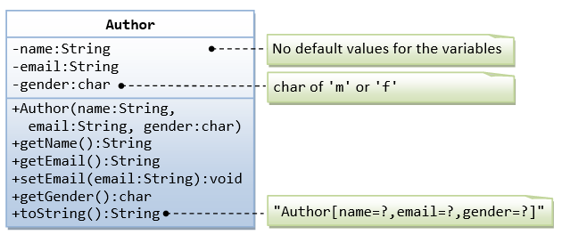

# OOP-composition

This first exercise shall lead you through all the concepts involved in OOP Composition.



A class called `Author` (as shown in the class diagram) is designed to model a book's author. It contains:

- Three private instance variables: `name` (String), `email` (String), and `gender` (char of either 'm' or 'f');
- One constructor to initialize the `name`, `email` and `gender` with the given values;
```public Author (String name, String email, char gender) {...}```
(There is no default constructor for Author, as there are no defaults for name, email and gender.)

- Public getters/setters: `getName()`, `getEmail()`, `setEmail()`, and `getGender()`;
(There are no setters for name and gender, as these attributes cannot be changed.)

- A `toString()` method that returns "`Author[name=?,email=?,gender=?]`", e.g.,
"`Author[name=Tan Ah Teck,email=ahTeck@somewhere.com,gender=m]`".

Write the `Author` class. Also write a test driver called `TestAuthor` to test all the public methods, e.g.,
```
Author ahTeck = new Author("Tan Ah Teck", "ahteck@nowhere.com", 'm'); // Test the constructor
System.out.println(ahTeck);  // Test toString()
ahTeck.setEmail("paulTan@nowhere.com");  // Test setter
System.out.println("name is: " + ahTeck.getName());     // Test getter
System.out.println("eamil is: " + ahTeck.getEmail());   // Test getter
System.out.println("gender is: " + ahTeck.getGender()); // Test gExerciseOOP_MyPolynomial.pngetter
```


A class called `Book` is designed (as shown in the class diagram) to model a book written by one author. It contains:

- Four private instance variables: `name` (String), `author` (of the class `Author` you have just created,
assume that a book has one and only one author), `price` (double), and `qty` (int);
- Two constructors:
`public Book (String name, Author author, double price) { ... }`, 
`public Book (String name, Author author, double price, int qty) { ... }`
- Public methods `getName()`, `getAuthor()`, `getPrice()`, `setPrice()`, `getQty()`, `setQty()`.
- A `toString()` that returns "`Book[name=?,Author[name=?,email=?,gender=?],price=?,qty=?`".  
You should reuse Author’s `toString()`.

Write the `Book` class (which uses the `Author` class written earlier). 
Also write a test driver called `TestBook` to test all the public methods in the class `Book`. 
Take note that you have to construct an instance of `Author` before you can construct an instance of `Book`.
E.g.,

```
// Construct an author instance
Author ahTeck = new Author("Tan Ah Teck", "ahteck@nowhere.com", 'm');
System.out.println(ahTeck);  // Author's toString()

Book dummyBook = new Book("Java for dummy", ahTeck, 19.95, 99);  // Test Book's Constructor
System.out.println(dummyBook);  // Test Book's toString()

// Test Getters and Setters
dummyBook.setPrice(29.95);
dummyBook.setQty(28);
System.out.println("name is: " + dummyBook.getName());
System.out.println("price is: " + dummyBook.getPrice());
System.out.println("qty is: " + dummyBook.getQty());
System.out.println("Author is: " + dummyBook.getAuthor());  // Author's toString()
System.out.println("Author's name is: " + dummyBook.getAuthor().getName());
System.out.println("Author's email is: " + dummyBook.getAuthor().getEmail());

// Use an anonymous instance of Author to construct a Book instance
Book anotherBook = new Book("more Java", 
      new Author("Paul Tan", "paul@somewhere.com", 'm'), 29.95);
System.out.println(anotherBook);  // toString()
```

Take note that both `Book` and `Author` classes have a variable called `name`. 
However, it can be differentiated via the referencing instance. 
For a `Book` instance says aBook, `aBook.name` refers to the name of the book; 
whereas for an Author's instance say auAuthor, `anAuthor.name` refers to the name of the author. 
There is no need (and not recommended) to call the variables `bookName` and `authorName`.

**TRY:**

Printing the name and email of the author from a `Book` instance. 
(Hint: `aBook.getAuthor().getName()`, `aBook.getAuthor().getEmail()`).

Introduce new methods called `getAuthorName()`, `getAuthorEmail()`, `getAuthorGender()` in the `Book`
class to return the name, email and gender of the author of the book. 
For example,
```
public String getAuthorName() {
    return author.getName();  // cannot use author.name as name is private in Author class
}
```